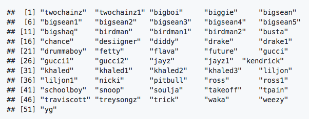
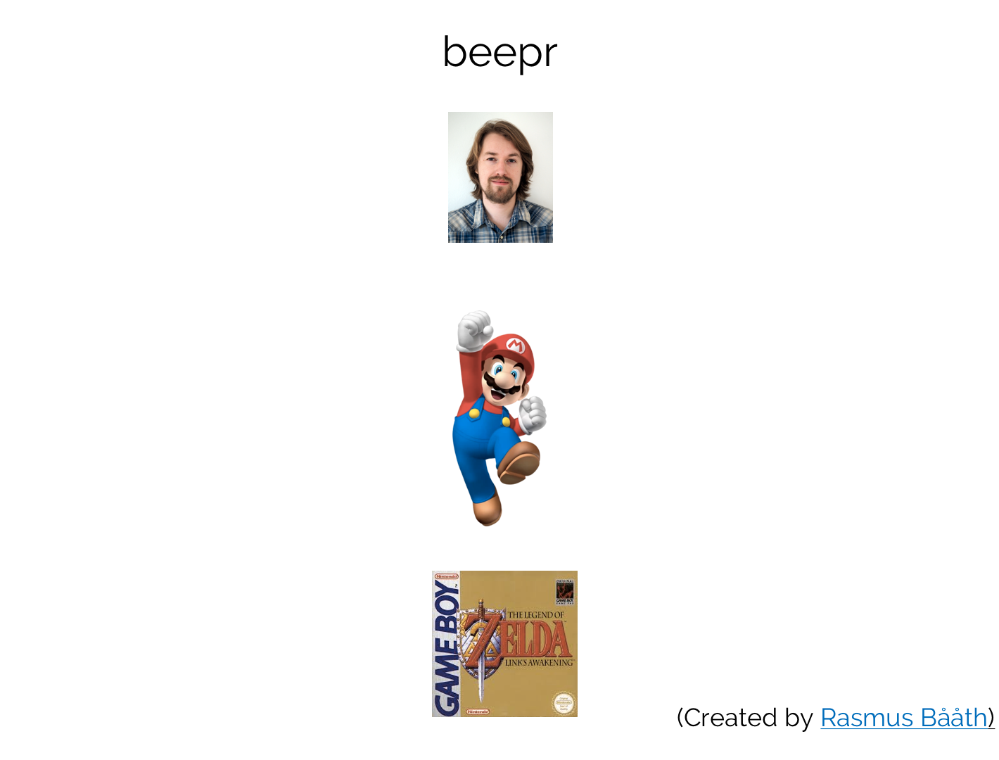
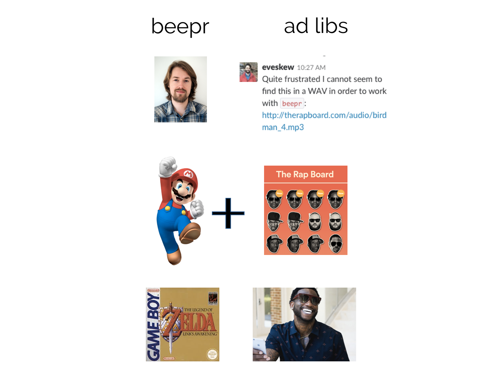
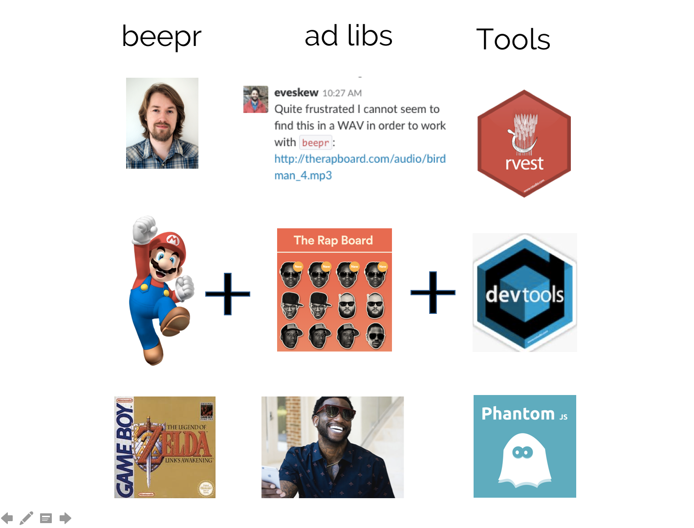
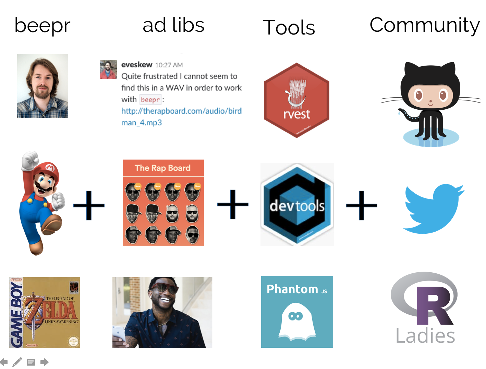
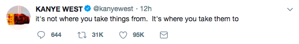
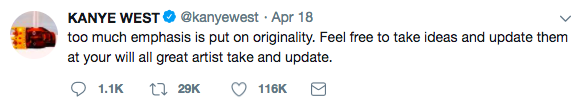
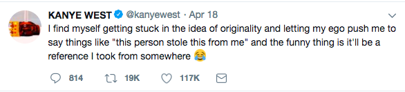
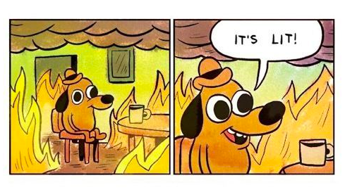

```{r setup, include=FALSE}
knitr::opts_chunk$set(echo = TRUE, eval = FALSE,
  collapse = TRUE, comment = "#>")
options(htmltools.dir.version = FALSE)
htmltools::tagList(rmarkdown::html_dependency_font_awesome())
```


---

class: center, middle, inverse
background-image: url(https://static.highsnobiety.com/wp-content/uploads/2017/12/15001011/gucci-mane-el-gato-human-glacier-cover-001.jpg)

# BRRR: the Package 

--
<audio controls>
  <source src="https://raw.githubusercontent.com/brooke-watson/BRRR/master/inst/adlibs/gucci1.wav" type="audio/wav">
</audio>

<br>

--

<audio controls>
  <source src="https://raw.githubusercontent.com/brooke-watson/BRRR/master/inst/adlibs/birdman1.wav" type="audio/wav">
</audio>

--

```{r}
devtools::install_github("brooke-watson/BRRR")
library(BRRR)

```

---

layout: false  

## BRRR 

- BRRR has one function: `skrrrahh()`, which plays a short rap ad lib when called. 

```{r}
devtools::install_github("brooke-watson/BRRR")
library(BRRR)

skrrrahh("bigshaq")
```

--

<audio controls>
  <source src="https://raw.githubusercontent.com/brooke-watson/BRRR/master/inst/adlibs/bigshaq.wav" type="audio/wav">
</audio>


---

## BRRR is a kitchen timer for your code

--

...if your kitchen timer is a very congratulatory Flava Flav. 

--
```{r}

    pkgs <- installed.packages()[, 1]
    lapply(pkgs, update.packages())
    skrrrahh("flava")
    
```

--
<span> <center>
 </center>
</span>

--

<center>
<audio controls>
  <source src="https://raw.githubusercontent.com/brooke-watson/BRRR/master/inst/adlibs/flava.wav" type="audio/wav">
</audio>
</center>

---

<br><br>

.left-column[

- or Lil Jon 

```{r}
BRRR::skrrrahh("liljon")
```


<audio controls>
  <source src="https://raw.githubusercontent.com/brooke-watson/BRRR/master/inst/adlibs/liljon.wav" type="audio/wav">
</audio>
]

--

.right-column[

- or Birdman.

```{r}
BRRR::skrrrahh("birdman1")
```


<audio controls>
  <source src="https://raw.githubusercontent.com/brooke-watson/BRRR/master/inst/adlibs/birdman1.wav" type="audio/wav">
</audio>

]

---

## Some BRRR sounds are ideal for error messages

```{r}
f <- function(x) { 
    if(!is.numeric(x)) { 
        stop(BRRR::skrrrahh("khaled2")) 
    } else return(x + 1)
}

f(1)
f("character")

```

<center>
<audio controls>
  <source src="https://raw.githubusercontent.com/brooke-watson/BRRR/master/inst/adlibs/khaled2.wav" type="audio/wav">
</audio>
</center>

---

## ... or in tests.

```{r}

if (assertthat::are_equal(1+1, 2)) {
    skrrrahh(1)
} else skrrrahh(10)

if (assertthat::are_equal(1+1, 3)) {
    skrrrahh(1)
} else skrrrahh(10)

```

<center>
<audio controls>
  <source src="https://raw.githubusercontent.com/brooke-watson/BRRR/master/inst/adlibs/twochainz.wav" type="audio/wav">
</audio>

<br>
<br>

<audio controls>
  <source src="https://raw.githubusercontent.com/brooke-watson/BRRR/master/inst/adlibs/bigsean5.wav" type="audio/wav">
</audio> 


</center>

---

# There are many sounds to choose from.



--
- If you (like me) are prone to caring Too Much about this, it is possible--nay, probable!--that I have neglected your Favorite Boy.
--

- If the above is true, I kindly suggest that you fork it! 
--
in Github. 


---
class: center, middle, inverse
background-image: url(https://static.highsnobiety.com/wp-content/uploads/2017/12/15001011/gucci-mane-el-gato-human-glacier-cover-001.jpg)

# BRRR: the Backstory

---



<audio controls>
  <source src="https://raw.githubusercontent.com/rasmusab/beepr/master/inst/sounds/smb_stage_clear.wav" type="audio/wav">
</audio>


---



---



---



---

class: center, middle, inverse, .large

## (One way to) become an open source contributor

<audio controls>
  <source src='https://raw.githubusercontent.com/brooke-watson/BRRR/master/inst/adlibs/khaled1.wav' type='audio/wav'>
</audio>

--

1. Copy something that exists

--

2. Add a thing you like

--

3. Keep adding

--

4. Add until your copy grows its own legs

--

5. Congratulations, you made ✨ A Thing! ✨

---

class: center, middle, inverse  

.small[

]

---

class: center, middle, inverse







---

class: center, middle, inverse

## Contributing to Open Source

--


---

class: center, middle, inverse

## Contributing to Open Source

--




---

class: inverse 

# Resources 

Twitter: [@brooklynevery1](https://twitter.com/brooklynevery1)

These slides on Github: [github.com/brooke-watson/nyr](https://github.com/brooke-watson/nyr)

The making of BRRR: [blog.brooke.science/posts/scraping-javascript-websites-in-r/](https://blog.brooke.science/posts/scraping-javascript-websites-in-r/)
